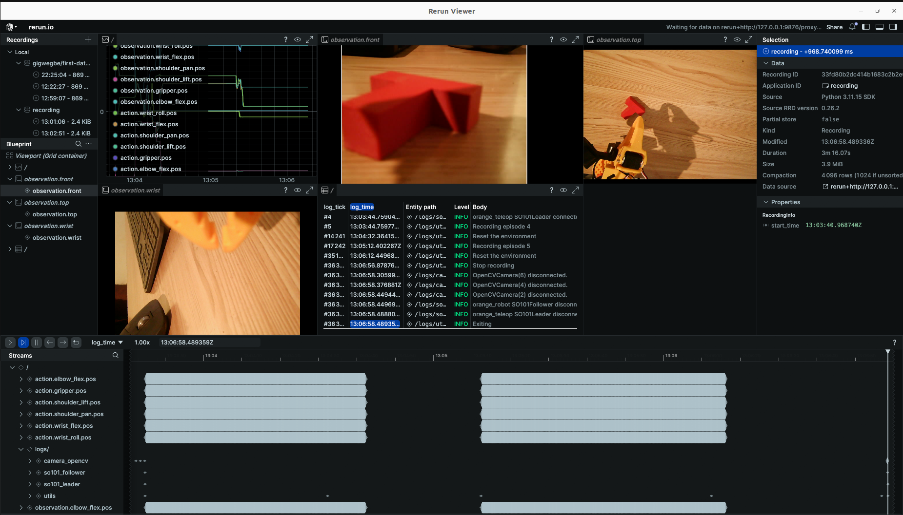

# SO-101: Teleop, Cameras, Hands-Free Recording, and Dataset Visualization

Notes from getting a full teleop → record → visualize loop working on the real SO-101, plus a hands-free foot pedal setup for episode control.

## 1. Port and ID setup

Leader and follower show up as separate `/dev/ttyACM*` serial devices. These can shift after a replug or process kill, so always confirm before running anything:

```bash
ls /dev/ttyACM* /dev/ttyUSB*
```

If unsure which port is which arm, walk through them one at a time:

```bash
lerobot-find-port
```

Set env vars once confirmed:

```bash
export TELEOP_PORT=/dev/ttyACM0
export ROBOT_PORT=/dev/ttyACM1
export TELEOP_ID=orange_teleop
export ROBOT_ID=orange_robot
```

## 2. Calibration

Run once per arm before teleoperating:

```bash
lerobot-calibrate \
  --teleop.type=so101_leader \
  --teleop.port=/dev/ttyACM0 \
  --teleop.id=orange_teleop

lerobot-calibrate \
  --robot.type=so101_follower \
  --robot.port=/dev/ttyACM1 \
  --robot.id=orange_robot
```

Optional sanity check script: `so101_check_calibration.py`.

## 3. Finding working cameras

```bash
lerobot-find-cameras opencv
```

Lessons learned here:

- Detected indices can include dead ports. One camera (`/dev/video6` in this session) showed up as detected but failed with `read failed (status=False)` — it never actually produced frames. Detected ≠ working; always test a real frame read.
- OpenCV camera indices are not stable identifiers — they can shift between sessions depending on what else is plugged in or what order devices enumerate.
- To positively identify which physical camera is which (wrist vs front), grab a snapshot from each candidate index and inspect it:

```python
import cv2
for idx in [0, 2, 4]:
    cap = cv2.VideoCapture(idx)
    ret, frame = cap.read()
    if ret:
        cv2.imwrite(f"/tmp/cam_{idx}.jpg", frame)
        print(f"Camera {idx}: saved")
    else:
        print(f"Camera {idx}: failed to read")
    cap.release()
```

Once confirmed:

```bash
export CAMERA_GRIPPER=2
export CAMERA_EXTERNAL=4
```

When running three cameras, one camera often fails to stream (`read failed (status=False)`) because all cameras default to YUYV (uncompressed), which saturates the shared USB bus. Forcing at least one camera to `fourcc: MJPG` (compressed) drops the bandwidth enough for all of them to run. See section 8 for the three-camera record command.

## 4. Teleoperation

```bash
lerobot-teleoperate \
  --robot.type=so101_follower \
  --robot.port="$ROBOT_PORT" \
  --robot.id="$ROBOT_ID" \
  --teleop.type=so101_leader \
  --teleop.port="$TELEOP_PORT" \
  --teleop.id="$TELEOP_ID" \
  --display_data=true \
  --robot.cameras='{
    "wrist": {
      "type": "opencv",
      "index_or_path": '"$CAMERA_GRIPPER"',
      "width": 640,
      "height": 480,
      "fps": 30
    },
    "front": {
      "type": "opencv",
      "index_or_path": '"$CAMERA_EXTERNAL"',
      "width": 640,
      "height": 480,
      "fps": 30
    }
  }'
```

Errors hit and fixed along the way:

- `ConnectionError: Failed to open OpenCVCamera(2)` — camera index had shifted after a replug. Fixed by re-running `lerobot-find-cameras opencv` and updating the index.
- `ConnectionError: Failed to write 'Torque_Enable' on id_=3 ... There is no status packet!` — a servo bus communication failure, not a camera issue. Cause was a stale process still holding the serial port after a previous run. Fixed by clearing all lingering LeRobot processes first:

```bash
pkill -9 -f lerobot
ps aux | grep lerobot   # to inspect before killing, if needed
```

- To exit teleoperate cleanly: **Ctrl+C** in the terminal. This lets LeRobot disable torque and release the camera/serial handles properly — closing the terminal window instead can leave the port locked.

## 5. PID tuning for smooth motion

If the follower is jolting or jittery when tracking the leader, tune the servos' position-loop PID gains. The Feetech STS3215 servos each run an internal P/I/D loop; this fork exposes the gains as CLI flags on the follower, so no file edits or register writes are needed — just add them to the teleop (or record) command.

```bash
lerobot-teleoperate \
  --robot.type=so101_follower \
  --robot.port="$ROBOT_PORT" \
  --robot.id="$ROBOT_ID" \
  --teleop.type=so101_leader \
  --teleop.port="$TELEOP_PORT" \
  --teleop.id="$TELEOP_ID" \
  --robot.p_coefficient=8 \
  --robot.i_coefficient=0 \
  --robot.d_coefficient=20 \
  --display_data=true \
  --robot.cameras='{ ... }'
```

Defaults: `p_coefficient=8`, `i_coefficient=0`, `d_coefficient=20`.

What each gain does:

- **`p_coefficient`** (proportional / stiffness) — lower = smoother but less responsive; higher = more responsive but potentially jittery. If the arm is jittery, lower P; if it feels soft or laggy, raise it.
- **`d_coefficient`** (derivative / damping) — lower = less damping; higher = more damping but too much causes its own oscillation. Add D to smooth overshoot after setting P.
- **`i_coefficient`** (integral) — usually left at 0 for position control. Only raise it slightly if a joint consistently settles a little off-target under load.

Tuning loop: start at defaults, change one gain at a time, re-run, feel the result. If jittery, drop `p_coefficient` a couple of points (8 → 6 → 4) until smooth; if that makes it too soft, nudge P back up and adjust `d_coefficient` instead.

Notes:

- **Follower only.** In normal leader-follower teleop you tune only the follower — the leader runs backdriven (torque off) with no position loop to tune, so it has no equivalent `teleop.p_coefficient`. The leader would only have gains to tune in a motorized/force-feedback setup, which isn't the standard config.
- These are CLI flags, so nothing persists to the servo EEPROM — gains are applied at connect time each run and revert simply by dropping the flag.
- The gains here are global (applied to all follower motors at once), so you're tuning the whole arm's feel, not individual joints.
- This flag interface is specific to the customized training fork (gains defined as fields in `config_so101_follower.py`). On stock LeRobot these flags won't exist; you'd instead write the `P_Coefficient`/`I_Coefficient`/`D_Coefficient` servo registers directly via a `FeetechMotorsBus` script.

## 6. Hands-free episode control with a foot pedal

Used a generic 3-button PCsensor USB foot pedal (shows up as a standard HID keyboard, no drivers needed) to drive `lerobot-record` without touching the keyboard.

**Tool:** [`footswitch`](https://github.com/rgerganov/footswitch) by rgerganov — a Linux CLI that writes the key mapping directly into the pedal's onboard memory (persistent across replugs/machines).

```bash
git clone https://github.com/rgerganov/footswitch
cd footswitch
make
sudo make install   # also installs a udev rule, so sudo isn't needed after a replug
```

Check detection:

```bash
lsusb | grep -i pc
# Bus 001 Device 092: ID 3553:b001 PCsensor FootSwitch
```

Read current mapping:

```bash
footswitch -r
```

LeRobot's recorder uses **right arrow** (accept episode, move on), **left arrow** (re-record), and **escape** (stop session). Two gotchas discovered while setting this up:

1. **Named keys aren't all recognized.** `-k right` and `-k left` silently failed and left those pedals `unconfigured`, while `-k esc` worked fine. Fix: use raw USB HID usage codes instead of key names:
   - Right Arrow = `4F`
   - Left Arrow = `50`

2. **The pedal firmware stores all three mappings as a single config block.** Setting pedals one command at a time causes each new write to blank out the other two. Fix: set all three pedals in **one single invocation**:

```bash
footswitch -1 -S '4F' -2 -S '50' -3 -k esc
footswitch -r
# [switch 1]: <right>
# [switch 2]: <left>
# [switch 3]: esc
```

Usage during recording:

- **Right pedal** → end current episode, move to next
- **Left pedal** → discard and re-record current episode
- **Center pedal** → stop the whole session (esc)

If a pedal seems to do the wrong thing, re-check `footswitch -r` first (confirm the firmware mapping didn't revert) before assuming a physical mix-up between pedal positions.

## 7. Recording a dataset

```bash
lerobot-record \
  --robot.type=so101_follower \
  --robot.port="$ROBOT_PORT" \
  --robot.id="$ROBOT_ID" \
  --teleop.type=so101_leader \
  --teleop.port="$TELEOP_PORT" \
  --teleop.id="$TELEOP_ID" \
  --display_data=true \
  --robot.cameras='{
    "wrist": {
      "type": "opencv",
      "index_or_path": '"$CAMERA_GRIPPER"',
      "width": 640,
      "height": 480,
      "fps": 30
    },
    "front": {
      "type": "opencv",
      "index_or_path": '"$CAMERA_EXTERNAL"',
      "width": 640,
      "height": 480,
      "fps": 30
    }
  }' \
  --dataset.repo_id=gigwegbe/first-dataset \
  --dataset.single_task="first dataset" \
  --dataset.num_episodes=50 \
  --dataset.fps=30 \
  --dataset.reset_time_s=10 \
  --dataset.push_to_hub=false
```

Keyboard controls during recording (these are the keys the foot pedal in section 6 maps to):

- **Right Arrow (→)** — early stop the current episode / reset period. Accepts the episode and moves on to the next one.
- **Left Arrow (←)** — cancel and re-record the current episode. Discards it and restarts.
- **ESC** — end the entire recording session early. Stops the session, encodes videos, and finalizes the dataset.

Notes:

- `--dataset.push_to_hub=false` keeps the dataset local only (at `~/.cache/huggingface/lerobot/<repo_id>`), since `lerobot-record` pushes to the Hub by default otherwise.
- `--dataset.reset_time_s` gives a pause between episodes to reset the scene before the next one starts recording automatically.
- Each completed episode gets encoded with SVT-AV1 — the `Svt[info]` log lines after an episode ends are normal, not errors.
- Hit a `ValueError: You must add one or several frames with add_frame before calling add_episode` crash once — caused by stopping (esc) right as a new, still-empty episode buffer opened. Earlier completed episodes remained safely saved; only the empty in-progress one failed. Lesson: let a couple of frames land (wait a beat after "Recording episode N" appears) before hitting the stop pedal, or stop during the reset window between episodes rather than mid-recording. In other words, don't hit ESC in the split-second a fresh episode opens.

## 8. Recording with three cameras (USB bandwidth fix)

Adding a third USB camera often makes one camera fail to stream — `read failed (status=False)` — even though `lerobot-find-cameras` detects it. The cause is USB bandwidth: all cameras default to YUYV (uncompressed), and three uncompressed 640x480@30 streams saturate a shared USB controller. The fix is to force at least the problem camera to `fourcc: MJPG` (motion-JPEG, compressed), which cuts its bandwidth enough for all three to run together. You can set MJPG on all cameras if needed.

```bash
export CAMERA_FRONT=4
export CAMERA_EXTERNAL=2
export CAMERA_WRIST=6

lerobot-record \
  --robot.type=so101_follower \
  --robot.port="$ROBOT_PORT" \
  --robot.id="$ROBOT_ID" \
  --teleop.type=so101_leader \
  --teleop.port="$TELEOP_PORT" \
  --teleop.id="$TELEOP_ID" \
  --display_data=true \
  --robot.cameras='{
    "wrist": {
      "type": "opencv",
      "index_or_path": '"$CAMERA_WRIST"',
      "width": 640,
      "height": 480,
      "fps": 30
    },
    "front": {
      "type": "opencv",
      "index_or_path": '"$CAMERA_FRONT"',
      "width": 640,
      "height": 480,
      "fps": 30,
      "fourcc": "MJPG"
    },
    "top": {
      "type": "opencv",
      "index_or_path": '"$CAMERA_EXTERNAL"',
      "width": 640,
      "height": 480,
      "fps": 30
    }
  }' \
  --dataset.repo_id=gigwegbe/first-dataset \
  --dataset.root=/home/george/.cache/huggingface/lerobot/gigwegbe/first-dataset \
  --dataset.single_task="first dataset" \
  --dataset.num_episodes=10 \
  --dataset.fps=30 \
  --dataset.reset_time_s=10 \
  --dataset.push_to_hub=false
```

Notes:

- Each camera needs a unique key. Here the three keys are `wrist`, `front`, and `top` — rename them to match your actual physical views.
- Watch for trailing commas inside the camera JSON (e.g. a comma after the last field in a block). The `--robot.cameras` value is parsed as JSON and a trailing comma breaks the parse.
- The number of cameras is part of the dataset's feature schema. You cannot add a third camera to a dataset that was started with two cameras and resume into it — the compatibility check will reject the mismatch. Start a fresh `repo_id` when changing the camera count.

## 9. Resuming an interrupted recording

If a recording session exits early (crash, accidental stop, or a killed process) before all episodes are collected, you can continue into the **same** dataset with `--resume=true` rather than starting over.

First, check how many episodes actually saved so you know how many are left. Read `total_episodes` from the dataset metadata:

```bash
cat ~/.cache/huggingface/lerobot/gigwegbe/first-dataset/meta/info.json | grep total_episodes
```

Then re-run the same record command with two changes: add `--resume=true`, add `--dataset.root`, and set `--dataset.num_episodes` to the number of episodes **remaining** (not the original total). If 12 of 50 saved, that's 38:

```bash
lerobot-record \
  --robot.type=so101_follower \
  --robot.port="$ROBOT_PORT" \
  --robot.id="$ROBOT_ID" \
  --teleop.type=so101_leader \
  --teleop.port="$TELEOP_PORT" \
  --teleop.id="$TELEOP_ID" \
  --display_data=true \
  --robot.cameras='{
    "wrist": {
      "type": "opencv",
      "index_or_path": '"$CAMERA_GRIPPER"',
      "width": 640,
      "height": 480,
      "fps": 30
    },
    "front": {
      "type": "opencv",
      "index_or_path": '"$CAMERA_EXTERNAL"',
      "width": 640,
      "height": 480,
      "fps": 30
    }
  }' \
  --dataset.repo_id=gigwegbe/first-dataset \
  --dataset.root=~/.cache/huggingface/lerobot/gigwegbe/first-dataset \
  --dataset.single_task="first dataset" \
  --dataset.num_episodes=38 \
  --dataset.fps=30 \
  --dataset.reset_time_s=10 \
  --dataset.push_to_hub=false \
  --resume=true
```

Notes and gotchas:

- **`--resume=true` is a top-level flag, not `--dataset.resume`.** (Older guides referencing `--control.resume=true` are from the deprecated `control_robot.py` era and don't apply to the current CLI.)
- **`--dataset.num_episodes` means *additional* episodes when resuming**, not the target total. Set it to `50 − total_episodes`.
- **`--dataset.root` is required to resume** a local dataset — without it the tool tries to fetch from the Hub.
- **Episode indexing continues automatically** from the last saved index; it does not restart at 0.
- **Everything else must match the original run** — same camera names, resolutions, fps, robot type, and id. On resume LeRobot runs a compatibility check and errors out on any mismatch (e.g. `Dataset metadata compatibility check failed`).
- **Re-running *without* `--resume=true` raises `FileExistsError`** because the dataset directory already exists. That's expected — it won't append or overwrite. Just add the flag. Only delete the directory if you actually intend to start over.
- **Known bug (GitHub issue #2049):** on lerobot 0.3.4 with dataset format v3.0, `--resume=true` can crash during video concatenation with a `time_base` / `Cannot access 'time_base' as a decoder` error. The same command works with resume off. Back up the dataset before resuming as cheap insurance:

```bash
cp -r ~/.cache/huggingface/lerobot/gigwegbe/first-dataset ~/first-dataset-backup
```

If you hit that crash, the fallback is to record the remaining episodes into a separate `repo_id` (e.g. `gigwegbe/first-dataset-part2`) and merge the two datasets afterward (merge requires identical features).

## 10. Visualizing a recorded dataset

```bash
lerobot-dataset-viz \
  --repo-id gigwegbe/first-dataset \
  --root ~/.cache/huggingface/lerobot/gigwegbe/first-dataset/ \
  --episode-index 0
```

- `--episode-index` is required — the visualizer shows one episode at a time, not the whole dataset in a single view. Swap the index to page through others.
- `--root` is required for local-only datasets (not pushed to the Hub) — without it, the tool tries to fetch from the Hub and fails.
- Opens a Rerun-based UI similar to the one used during live recording, but lets you scrub through saved episodes after the fact.
- To check how many episodes actually saved:

```bash
ls ~/.cache/huggingface/lerobot/gigwegbe/first-dataset/data/chunk-000/ | wc -l
```

## 11. Replaying an episode on the real robot

`lerobot-replay` re-executes a recorded episode's joint positions on the follower arm — the arm physically moves through the recorded trajectory. This is different from `lerobot-dataset-viz` (section 10), which just plays back the recorded footage on screen. Use replay to test repeatability of the arm's motion; use dataset-viz to review the recorded video/plots.

Replay only needs the follower arm — no leader, no cameras — because it just re-sends recorded joint positions:

```bash
lerobot-replay \
  --robot.type=so101_follower \
  --robot.port="$ROBOT_PORT" \
  --robot.id="$ROBOT_ID" \
  --dataset.repo_id=gigwegbe/first-dataset \
  --dataset.root=/home/george/.cache/huggingface/lerobot/gigwegbe/first-dataset \
  --dataset.episode=3
```

**Safety:** clear the workspace and keep a hand near the power/E-stop before running. The arm executes the recorded trajectory on its own, regardless of what's currently in front of it — if the scene isn't reset to its recording-time state, it can collide with anything out of place.

Notes and gotchas:

- **`lerobot-replay` has no `--display_data` flag.** Passing it errors with `unrecognized arguments: --display_data=true`. Replay doesn't open a Rerun window.
- **`--robot.cameras` is accepted but pointless for replay** — since there's no display, attaching cameras just initializes them for no visible benefit and adds parsing fragility. Leave the camera block out for a clean replay.
- **`--dataset.root` is still needed** for a local-only dataset so it doesn't try the Hub.
- **`--dataset.episode` (singular) picks the episode**; it can replay any episode from any LeRobot dataset, not just your own.
- **Watch copy-paste line scrambles.** A mangled multi-line paste once glued `--dataset.episode=3` onto the `--dataset.root` path (`--dataset.episode=3e/george/.cache/...`), which dropped `--dataset.root` and threw a misleading downstream error (`Couldn't find a choice class for 'opencv'`). If you see a camera/parser error that doesn't match your actual config, check the `--dataset.*` lines are intact and correctly ordered first.

## 12. Showing terminal logs inside the Rerun window (source patch)

By default the live Rerun viewer (`--display_data=true`) shows the camera feeds and the state/action plots, but LeRobot's terminal messages — `Recording episode N`, `Reset the environment`, `Stop recording` — only go to the terminal. A small patch routes Python's logging into Rerun as a time-synced Text Log panel, so those messages appear in the viewer alongside the footage and you can scrub the timeline to see which log line lines up with which frame.



Rerun provides a logging handler (`rr.LoggingHandler`) that forwards standard Python `logging` records into the viewer as `TextLog` entries. LeRobot inits Rerun but doesn't attach this handler, so we add it in `init_rerun`.

Edit `src/lerobot/utils/visualization_utils.py`: add `import logging` at the top, then append the handler block at the end of `init_rerun`:

```python
def init_rerun(session_name: str = "lerobot_control_loop") -> None:
    """Initializes the Rerun SDK for visualizing the control loop."""
    batch_size = os.getenv("RERUN_FLUSH_NUM_BYTES", "8000")
    os.environ["RERUN_FLUSH_NUM_BYTES"] = batch_size
    rr.init(session_name)
    memory_limit = os.getenv("LEROBOT_RERUN_MEMORY_LIMIT", "10%")
    rr.spawn(memory_limit=memory_limit)

    # Route Python logging into the Rerun viewer as a time-synced TextLog panel.
    # Lets you see "Recording episode N" / "Reset the environment" etc. inside Rerun.
    root_logger = logging.getLogger()
    if not any(isinstance(h, rr.LoggingHandler) for h in root_logger.handlers):
        rerun_handler = rr.LoggingHandler("logs")
        rerun_handler.setLevel(logging.INFO)
        root_logger.addHandler(rerun_handler)
```

Notes:

- LeRobot is installed editable (`pip install -e .` — check for `__editable__.lerobot-*.pth` in site-packages), so no wheel rebuild is needed: edit, save, re-run.
- After recording, the messages show up under a `logs/` entity in the Rerun streams panel (with sub-loggers like `camera_opencv`, `so101_follower`, `so101_leader`, `utils`). Open it as a Text Log view.
- Only messages that go through Python `logging` appear — anything using bare `print` or `log_say` audio cues won't show.
- The `if not any(...)` guard avoids attaching a duplicate handler if `init_rerun` runs twice in one process.
- Because this edits the source tree, keep it as a `.patch` file or a local commit so a future `git pull` doesn't silently clobber it. Undo with `git checkout src/lerobot/utils/visualization_utils.py`.

## 13. Editing datasets (delete, split, merge, features)

One CLI, `lerobot-edit-dataset`, handles most post-recording cleanup: deleting episodes, splitting into subsets, merging datasets, adding/removing features, and converting image datasets to video. Run `lerobot-edit-dataset --help` for the exact flags on your install — argument names drift between versions.

For all of these on a local-only dataset, keep `--root` pointing at the dataset (and see the bug note at the end). The typical workflow is: record → visualize → delete bad episodes → train.

**Delete episodes** — remove bad or empty episodes (e.g. the empty one from a crash):

```bash
lerobot-edit-dataset \
  --repo_id gigwegbe/first-dataset \
  --root /home/george/.cache/huggingface/lerobot/gigwegbe/first-dataset \
  --operation.type delete_episodes \
  --operation.episode_indices "[0, 2, 5]"
```

Add `--new_repo_id gigwegbe/first-dataset-cleaned` to write the result to a new dataset and leave the original untouched (safer).

**Split a dataset** — by ratio or by explicit indices. Outputs are saved as separate datasets with the split name appended (e.g. `first-dataset_train`):

```bash
# by ratio
lerobot-edit-dataset \
  --repo_id gigwegbe/first-dataset \
  --root /home/george/.cache/huggingface/lerobot/gigwegbe/first-dataset \
  --operation.type split \
  --operation.splits '{"train": 0.8, "val": 0.2}'

# by explicit episode indices
lerobot-edit-dataset \
  --repo_id gigwegbe/first-dataset \
  --root /home/george/.cache/huggingface/lerobot/gigwegbe/first-dataset \
  --operation.type split \
  --operation.splits '{"train": [0,1,2,3,4,5,6,7], "val": [8,9]}'
```

Split names are arbitrary. Note: most LeRobot training doesn't need a pre-split dataset — `lerobot-train` runs on the whole dataset and evaluation is usually done on the real robot. Split only if you specifically want a held-out offline eval set.

**Merge datasets** — combine two or more into one. Requires identical features (same cameras/names/count/resolution, same fps, same robot type, same state/action dims):

```bash
lerobot-edit-dataset \
  --repo_id gigwegbe/first-dataset-merged \
  --operation.type merge \
  --operation.repo_ids '["gigwegbe/first-dataset", "gigwegbe/first-dataset-part2"]'
```

The exact source-list flag (`--operation.repo_ids` vs `--operation.datasets`) varies by version — check `--help`. Merge is the main fallback for the resume crash (section 9): record the remaining episodes into a separate `repo_id` with the same config, then merge.

**Add / remove features** — `--operation.type remove_features` strips a stream you no longer want (e.g. an unused camera) without re-recording; `add_features` injects computed rewards or embeddings for reward-model/RL training. **Convert to video** re-encodes an older image-format dataset into the compressed v3 video layout.

**Known v3 bugs and the Python fallback.** On v3 datasets, delete/split/merge can crash with `ValueError: cannot convert float NaN to integer` (issue #2283), and deletion can fail specifically when `--root` is passed, during video re-encoding (issue #2316). Since these share the reindexing code path, they can hit any of these operations. Always back up first:

```bash
cp -r /home/george/.cache/huggingface/lerobot/gigwegbe/first-dataset ~/first-dataset-backup
```

If the CLI keeps crashing, the same operations exist as a Python API in `lerobot.datasets.dataset_tools` (`delete_episodes`, `split_dataset`, `merge_datasets`, `add_feature`, `remove_feature`), which often sidesteps the CLI bugs — load a `LeRobotDataset`, call the function, write to an `output_dir`:

```python
from lerobot.datasets.lerobot_dataset import LeRobotDataset
from lerobot.datasets.dataset_tools import delete_episodes

dataset = LeRobotDataset("gigwegbe/first-dataset")
cleaned = delete_episodes(
    dataset,
    episode_indices=[0, 2, 5],
    output_dir="./data/cleaned",
    repo_id="gigwegbe/first-dataset-cleaned",
)
```

## 14. Async policy inference client (for reference)

Used to run a remote policy server (e.g. Pi0.5 on a Mac) against the real robot over the network:

```bash
python -m lerobot.async_inference.robot_client \
  --server_address=192.168.1.66:8080 \
  --robot.type=so101_follower \
  --robot.port=/dev/ttyACM2 \
  --robot.id=orange_robot \
  --robot.cameras="{left_wrist_0_rgb: {type: opencv, index_or_path: 3, width: 640, height: 480, fps: 30}, right_wrist_0_rgb: {type: opencv, index_or_path: 0, width: 640, height: 480, fps: 30}, base_0_rgb: {type: opencv, index_or_path: 5, width: 640, height: 480, fps: 30}}" \
  --task="pick up the vial and place it in the rack" \
  --policy_type=pi05 \
  --pretrained_name_or_path=/Users/george/Projects/lero/models/pi05_base \
  --policy_device=mps \
  --actions_per_chunk=50
```

Note the camera key names differ from teleop/record (`left_wrist_0_rgb`, `right_wrist_0_rgb`, `base_0_rgb`) — these must match what the specific policy (Pi0.5 here) expects, not the generic `wrist`/`front` naming used elsewhere.

## 15. Isaac Lab sim-side teleop and recording

The same leader arm can drive a simulated SO-101 in Isaac Lab instead of (or alongside) the real follower — useful for testing tasks in sim before running them on hardware.

Basic teleop against the sim:

```bash
cd ~/Documents/new-lab/IsaacLab-5.1
./isaaclab.sh -p -m sim_to_real_so101.scripts.lerobot_agent --task Lerobot-So101-Teleop-Base
```

Recording a sim dataset for a specific task (here, a vials-to-rack pick-and-place task):

```bash
./isaaclab.sh -p -m sim_to_real_so101.scripts.lerobot_agent \
  --task Lerobot-So101-Teleop-Vials-To-Rack \
  --repo_id <your-hf-username>/vials-to-rack \
  --repo_root ./datasets/vials
```

Both commands run through `isaaclab.sh -p -m`, Isaac Lab's own Python module launcher, rather than the plain `lerobot-*` CLI entry points used for the real robot — the task name (`--task`) selects which registered Isaac Lab environment to load.

## 16. Cleanup

If ports lock up, cameras won't reconnect, or a session hangs:

```bash
pkill -9 -f lerobot
ps aux | grep lerobot
```

Then re-verify ports (`ls /dev/ttyACM*`) and cameras (`lerobot-find-cameras opencv`) before starting again — indices and enumeration order aren't guaranteed to stay the same across restarts.